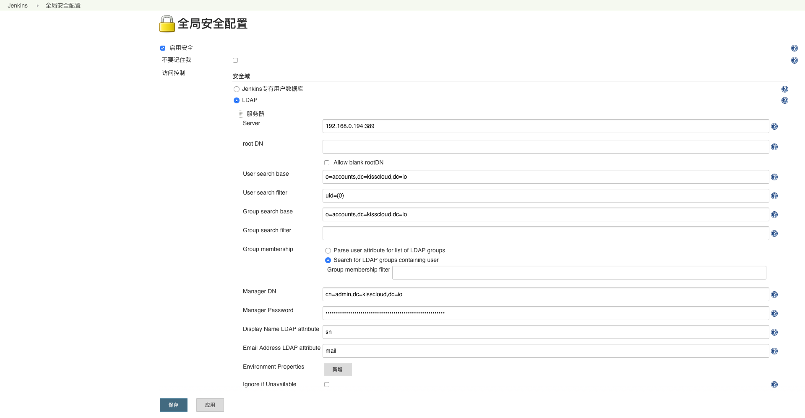

# 项目依赖

Nest 开发管理平台依赖外包软件 Docker、Gitlab、Jenkins、LDAP。

## 1. 安装 Docker

安装参考教程：[https://docs.docker.com/install/](https://docs.docker.com/install/)

## 2. 安装 Docker Compose

安装参考教程：[https://docs.docker.com/compose/](https://docs.docker.com/compose/)

## 3. 启动 LDAP

编辑 docker-compose.yml 配置文件修改默认的超级管理员密码。

```
$ git clone https://github.com/kisscloud/kiss-ldap-docker-compose-yml.git
$ cd kiss-ldap-docker-compose-yml
$ docker-compose up -d
```

## 4. 启动 Gitlab

```
$ git clone git@gitlab.com:kisscloud/kiss-gitlab-docker-compose-yml.git
$ cd kiss-gitlab-docker-compose-yml
$ docker-compose up -d
```

容器启动后，容器内的配置文件夹 `/etc/gitlab` 会映射到主机 `config` 文件夹内，如果使用 ssh clone 时通道不通，可能是配置文件权限导致，可尝试如下操作：

```
$ chmod 600 ssh_host_rsa_key ssh_host_ecdsa_key ssh_host_ed25519_key
```

配置 LDAP：

修改 `config/gitlab.rb` 配置文件，写入 LDAP 配置，使用 docker-compose 重启容器即可。

```yaml
gitlab_rails['ldap_enabled'] = true

gitlab_rails['ldap_servers'] = YAML.load <<-'EOS'
  main:
    label: 'LDAP'
    host: 'localhost'
    port: 389
    uid: 'uid'
    bind_dn: 'cn=admin,dc=kisscloud,dc=io'
    password: 'kisscloud'
    encryption: 'plain'
    base: 'o=accounts,dc=kisscloud,dc=io'
EOS
```

## 5. 启动 Jenkins

```
$ git clone git@gitlab.com:kisscloud/kiss-jenkins-docker-compose-yml.git
$ cd kiss-jenkins-docker-compose-yml
$ docker-compose up -d
```

容器启动后，通过图形化界面配置 LDAP 和编译依赖的插件。

### 5.1 生成容器 root 用户公钥

在宿主机上生成公钥，通过容器映射到容器中。同时需要将该公钥添加至 Gitlab 的 root 用户，用来在构建时拉取代码仓库。

**生成公钥：**
```
$ ssh-keygen
```

**编辑 docker-compose.yml:**

```yml
version: '2'
services:
  jenkins:
    image: "jenkins/jenkins:lts"
    container_name: "kiss-jenkins"
    user: "root"
    volumes:
      - "$PWD/data:/var/jenkins_home"
      # 映射公私钥
      - "/root/.ssh/id_rsa:/root/.ssh/id_rsa"       
      - "/root/.ssh/id_rsa.pub:/root/.ssh/id_rsa.pub"
    ports:
      - "8080:8080"
      - "50000:50000"
```

### 5.2 Jenkins 配置 LDAP

安装 LDAP 插件后，在 Jenkin 全局安全配置中配置：



### 5.3 Jenkins 配置 golang 环境

[https://plugins.jenkins.io/golang](https://plugins.jenkins.io/golang)

### 5.4 Jenkins 配置 node.js 环境
[https://plugins.jenkins.io/nodejs](https://plugins.jenkins.io/nodejs)

## 6. 安装 SaltStuck

### 6.1 主节点

**安装：**
```
$ yum install salt-master -y
$ yum install salt-api -y
```

**添加用户：**

```
$ useradd -M -s /sbin/nologin salt-api
$  passwd salt-api
```

**编辑 API 配置：**

```
$ vim /etc/salt/master.d/api.conf
```

输入内容：

```
rest_cherrypy:
  port: 8000
```

**编辑授权配置：**

```
$ vim /etc/salt/master.d/eauth.conf
```

输入内容：

```
external_auth:
  pam:
    saltapi:
      - .*
      - '@wheel'
      - '@runner'
```

**启动：**

```
$ salt-master -d
$ salt-api -d
```


**测试:**

查看用户TOKEN：

```
curl -k http://127.0.0.1:8000/login -H "Accept: application/x-yaml"  -d username='salt-api' -d password='12345678'  -d eauth='pam'
```


### 6.1 子节点


**安装：**
```
$ yum install salt-minion -y
```

**启动：**
```
$ salt-minion -d
```